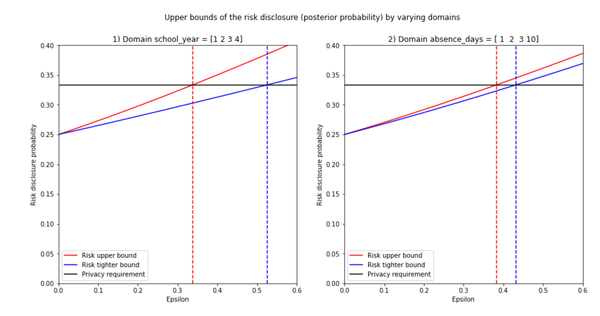
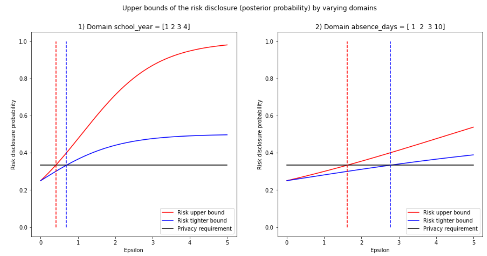

# Choosing Epsilon for Differential Privacy

## Goal

The goal of this notebook is to implement the following paper from 2011 with around 20 citations, ***How Much Is Enough? Choosing Epsilon for Differential Privacy***: [link to pdf](https://git.gnunet.org/bibliography.git/plain/docs/Choosing-%CE%B5-2011Lee.pdf), [link to Springer Link](https://link.springer.com/chapter/10.1007/978-3-642-24861-0_22)

## Paper summary

This paper states that even though Differential Privacy (DP) protects any individual in a dataset by cloaking with noise the most extreme query answers possible between 2 neighboring datasets, due to the finite amount of dataset possibilities and the worst-case adversary model (almost perfect background knowledge and infinite computation power), some distributions of the real dataset behind the DP query results are more likely than others, and therefore this needs to be taken into consideration when calculating epsilon. The authors used a sensitivity based on unbounded DP and an exact calculation of the norms for their dataset to find a tight bound for epsilon with binary search.

My humble opinion is that the paper is succinct, elegant and it has the ability to take your understanding of DP further. I would like to thank the authors **Jaewoo Lee** and **Chris Clifton** for these days I spent implementing :) and I invite everyone to have a look at the paper and check the code if you want to understand it better.

[Jump to the replicated figure if you are impatient](#results) :) 
The notebook allows you to expand and test the approach of the paper for different queries. They plot the mean query, but I also plotted the median query. I encourage you to get the code and plot e.g. the variance query.

## Notebook contributions

[Notebook](https://github.com/gonzalo-munillag/Blog/blob/main/Extant_Papers_Implementations/A_method_to_choose_epsilon/How_much_is_enough_Calculating_An_Optimal_Epsilon.ipynb)

1. I coded a function that calculates the bounded and unbounded sensitivity of a dataset formed by numeric columns. However, how to code the algorithm was not explained in the paper. You can also vary the hamming distance in the function. You can check a more detail view of these function in this other of my [blog posts](https://github.com/gonzalo-munillag/Blog/tree/main/My_implementations/Global_sensitivity). I.e.: This function to empirically calculates the sensitivity creates all possible neighboring datasets, with k less or more records (for unbounded DP) and with the same amount of records but changing k values (bounded DP). Where k is the hamming distance. The function calculates the query result for each possible neighboring dataset, then calculates all possible L1 norms, and then chooses the max.
IMPORTANT: The authors use an approximation (5.1 equation 4-5) based on the released dataset and its neighbors (delta_v) and sensitivity based on unbounded DP (delta_f) to calculate the upper bound. In this notebook, however, I use the definition for sensitivity based on bounded DP as delta_v, because to the best of my knowledge, it should be equal to the one the authors chose as long as I keep the hamming distance to 1. Nonetheless, the results obtained are the same as the authors'. Perhaps back then, the terms bounded and unbounded DP were not used.
3. I found no mistakes in the paper, only a typo of a number when substituting values in formula (The numerator should be 0.3062 and not 0.3602 on page 333 (9 of the PDF)). 
4. I coded the formulas for a uniform prior, posterior, upper, and tighter bound of the posterior, for a given dataset and query type.
5. I coded the binary search explained in the paper to find the correct value of epsilon (given a disclosure risk), for any query type.
6. With this code, you can easily play by using larger or different datasets than the one used in the paper. I used that exact one to replicate the results they had.
7. This notebook implements more queries, beyond the mean and the median used for explanations in the paper. I encourage you to try them out!
  
### Some concepts before we start:

- When I talk about bounded sensitivity, I refer to the sensitivity that comes from a bounded DP definition, i.e. the neighboring dataset is built by changing the records of the dataset (not adding to removing records). E.g. x = {1, 2, 3} with universe X = {1, 2, 3, 4}, a neighboring dataset in this case would be: x' = {1, 2, 4}
-  When I talk about unbounded sensitivity, I refer to the sensitivity that comes from an unbounded DP definition, i.e. the neighboring dataset is built by adding or removing records) E.g. x = {1, 2, 3} with universe X = {1, 2, 3, 4}, a neighboring dataset in this case could be: x' = {1, 2} or {1, 3} or {1, 2, 3, 4}
- The prior is the prior knowledge of an adversary, i.e. his/her best guess about which dataset is probably the real one. The paper and this notebook assume a uniform prior.
- The posterior is the updated knowledge of the adversary, i.e. once he/she has seen the query results,  the posterior maps a probability to a possible real dataset. The higher it is, the more confident will the adversary be about a dataset being the real one.

# Results

This is the plot I replicated faithfully from the paper:

I applied a binary search and found the optimal values for epsilon. Have a look:

I went a step further and also plotted the median and found the optimal values for epsilon. here is the result:

