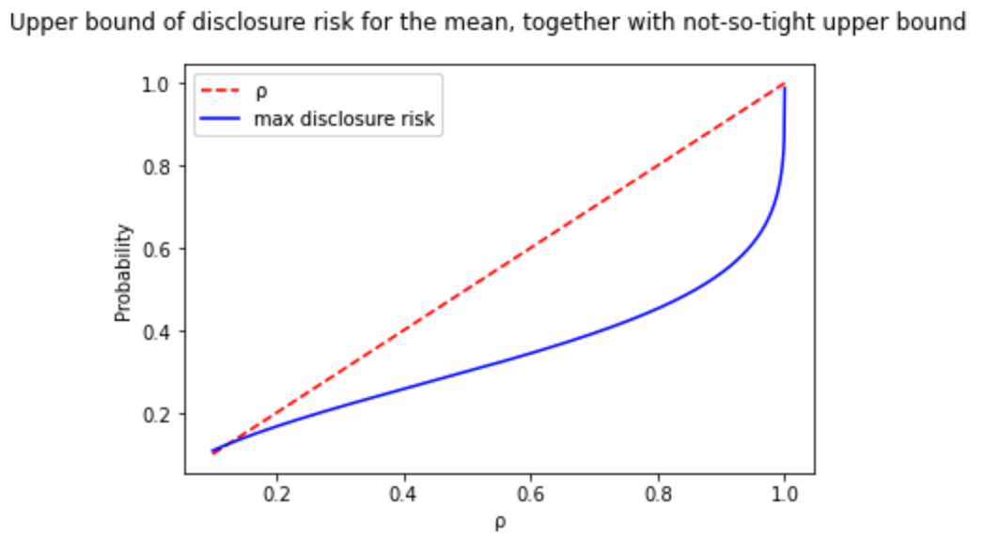
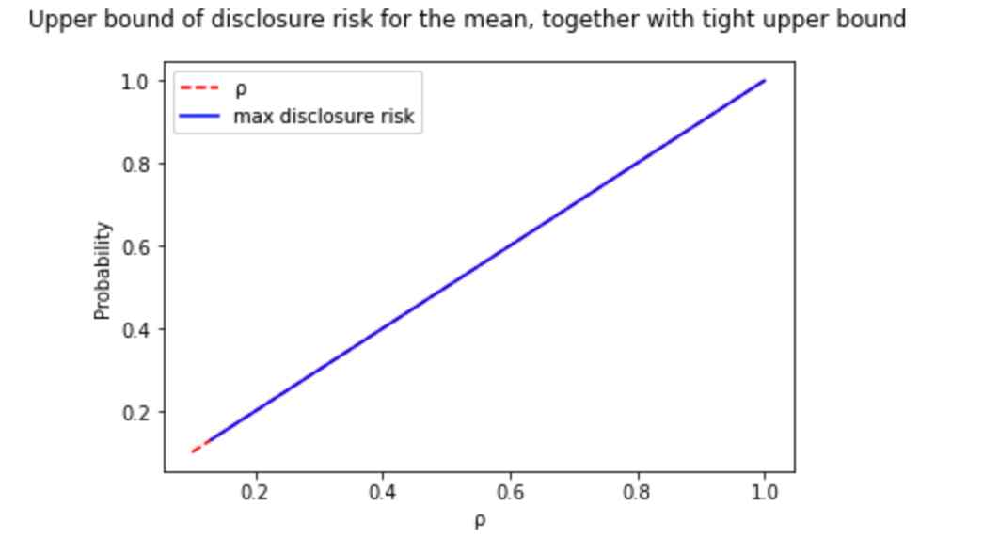
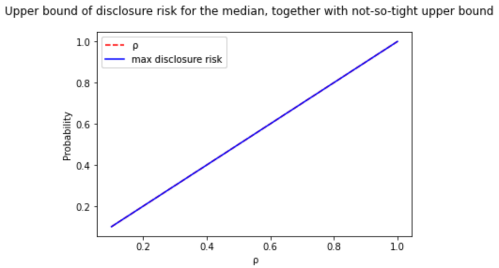
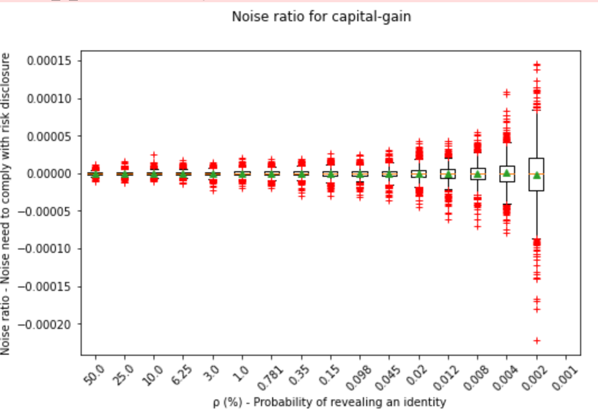
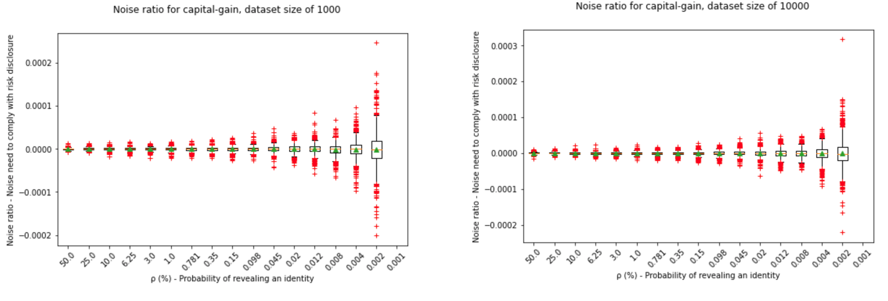

# Extant paper implementation: Differential Identifiability

[Notebook](https://github.com/gonzalo-munillag/Blog/blob/main/Extant_Papers_Implementations/Differential_Identifiability/Differential_identifiability.ipynb)

## Goal

The goal of this notebook is to implement the following paper from 2012 with around 50 citations. _**Differential Identifiability**_ is a work by Jaewoo Lee, which you may find [here](https://dl.acm.org/doi/10.1145/2339530.2339695).  
For more background of what differential privacy is, check this old [post](https://github.com/gonzalo-munillag/Blog/blob/main/Posts/Basic_Definitions_of_Differential_Privacy.pdf).

## Notebook contributions

1. I explain the steps involved in the proof of differential identifiability in a more granular way than the ones provided in the paper, so that other researchers can quickly and deeply understand the publication
2. I provide the source code to implement differential identifiability
3. I provide my humble thoughts about the usefulness of these publication
4. I verify that the results from the computations in the paper are correct
5. All the results check out; however, I have not been able to replicate the sensitive range of the standard deviation

## Paper summary

Differential privacy (DP) applied to analytics ensures that the results do not reveal any additional information about the individuals who are not in the dataset.
While DP (Syntactic method) has mathematical guarantees of indistinguishability and avoids modeling the prior knowledge of an adversary (A) unlike any other semantic method such as k-anonymity, DP does not include an intuitive or systematic process to select the parameter ε. How can we go from extant data privacy regulation to actionable DP algorithms? ε limits how much an individual may affect the resulting model, not how much information is revealed from an individual, which is to what regulation refers. This work from Jaewoo Lee strives to make this process simpler by introducing a new parameter **ρ, which indicates the probability that an individual contributes to the results of the query** is. Jaewoo calculated the worst-case probability that an individual is in the US Census (Looking at people older than 85), rounding the probability to 1.5\%, and using this number to set his new parameter. If the algorithm executed in a set of possible worlds yields a posterior for at least one of them larger than ρ, then the data of individuals in the dataset may be linked to their identities, or the data may be linked to other datasets.  
This new formulation of DP, called differential identifiability (DI), offers the same guarantees, i.e., offers protection against an arbitrarily strong adversary.  
Additionally, there is a connection between ε and ρ, which one can exploit to set ε based on ρ.  

In this paper, Jaewoo proves how to achieve DI and gives examples of how to use it.

Great knowledge nugget:   
"The protection of differential privacy measures only the impact of an individual on the output, not the ability to identify an individual [13], or even the ability to infer data values for an individual [4]."

## My thoughts on the paper

I very much liked this paper, it is concise and informative. He makes the math beautifully simple yet powerful. It helps to see DP from another angle and increase your understanding of the technology. However, I think it is also non-trivial to go from regulation to a probability that tells you how likely it is to find someone in the dataset. In the paper, Jaewoo calculates the chances that someone is in the dataset when that person is older than 85, but he does not consider the additional information from other datasets, which may increase this probability. While DP with ε allows you to avoid considering prior knowledge (Only the simple but worst-case scenario of an informed adversary), ρ makes you consider it, and finding datasets that can be linked and therefore increase the probability of identification is again a difficult task.

## Selected replicated plots

All the plots where successfully replicated.

This plot shows the upper bound formulated in the paper.

I performed binary search to find the optimal value of ε per value of risk disclosure (ρ). This way I went from the previous image to a tight upper bound curve:

However, for some functions like the median, there is no need to go beyond the formulation, because the upper bound is an equality, and therefore, you get precisely the amount of noise you need.

We can see here how the noise range widens the less risk disclosure risk is accepted:

Also for values of  ε for the DP enthusiasts:

Finally, we can see that varying the dataset size, we need less noise the larger the dataset is:

I hope you enjoy the [notebook](https://github.com/gonzalo-munillag/Blog/blob/main/Extant_Papers_Implementations/Differential_Identifiability/Differential_identifiability.ipynb)!
