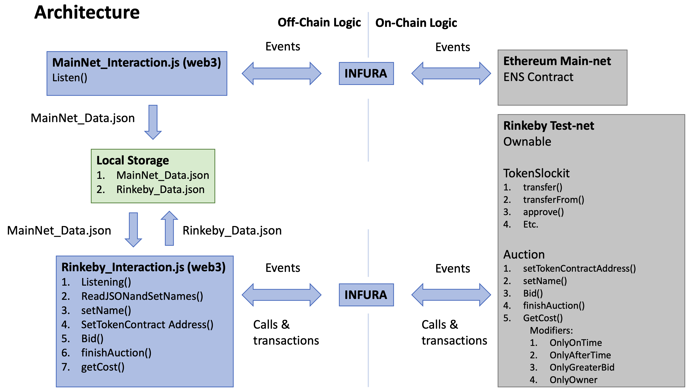

# An Auction in an Ethereum Smart Contract

This is a small silly application to deploy an auction as a smart contract of names in the Ethereum Name Service contract using tokens in the Rinkeby test net.
I had to find an excuse to develop some smart contracts...

