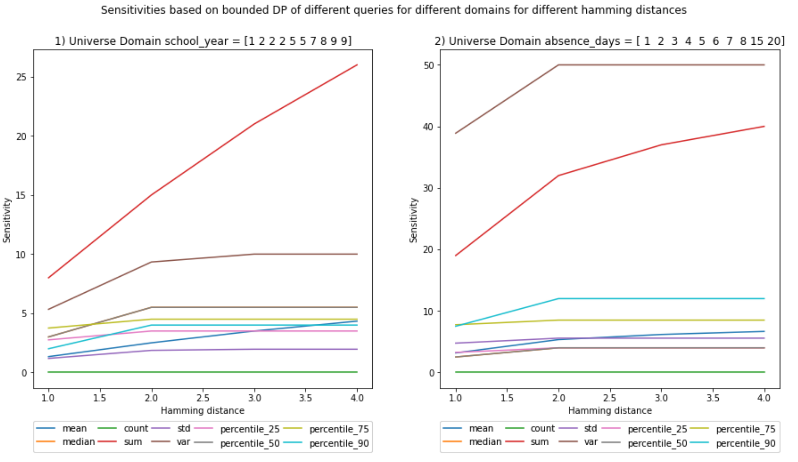
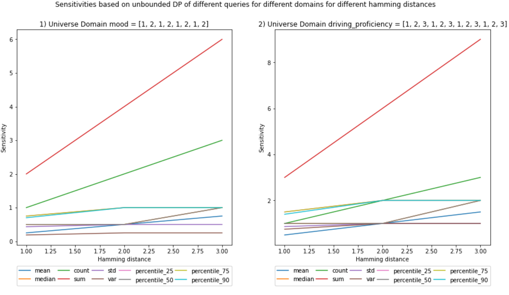
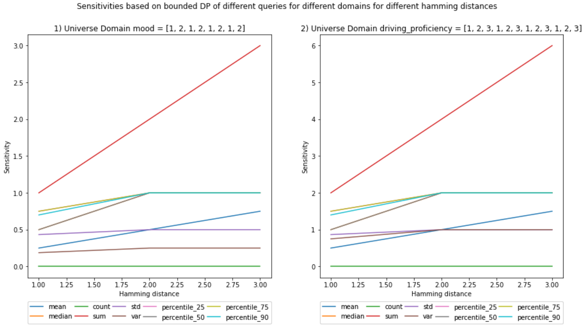

# Global Sensitivity From Scratch

## Goal

This [notebook](https://github.com/gonzalo-munillag/Blog/blob/main/My_implementations/Global_sensitivity/Global_Sensitivity.ipynb) aims to showcase two functions, one that implements sensitivity based on the unbounded differential privacy (DP) definition, and another that implements sensitivity based on a bounded definition.
I am not aiming for efficiency but for a deeper understanding of how to implement sensitivity empirically from scratch.

## Background

Before continuing there needs to be some clarifications:
In bounded DP, the neighboring dataset is built by changing the records of the dataset (not adding to removing records). E.g. x = {1, 2, 3} (|x|=3) with universe X = {1, 2, 3, 4}, a neighboring dataset in this case would be: x' = {1, 2, 4} (|x'| = 3). They have the same cardinality.
In unbounded DP definition, the neighboring dataset is built by adding ot removing records. E.g. x = {1, 2, 3} (|x| = 3) with universe X = {1, 2, 3, 4}, a neighboring dataset in this case could be: x' = {1, 2} or {1, 3} or {1, 2, 3, 4} (|x|=2 or |x|=2 or |x|=4, but not |x|=3). Their cardinality differs by 1.
In this [book](https://www.amazon.com/Differential-Privacy-Practice-Synthesis-Information/dp/1627054936) they authors explain why we should stick to unbounded sensitivity.
**The datasets are multisets, and their cardinality is the sum of the multiplicities of each value they contain.**
The neighboring datasets are also multisets and are considered neighbors if the Hamming distance concerning the original dataset is of value k. The data scientist sets this parameter, but the original definition of DP has a value of k=1.

The Hamming distance can be seen as the cardinality of the symmetric difference between 2 datasets. With this in mind, the definition of DP can be written as:

P(M(x) = O) = P(M(x') = O) * exp(epsilon * |x ⊖ x'|)

Where M is a randomized computation, x a dataset, x' its neighbor at Hamming distance k = |x ⊖ x'|, and O output of M given x and x'. 

K was first defined to be equal to 1 because one aims to protect one individual in the dataset, and by definition, each individual within would therefore be protected. By making the probabilities of obtaining an output *o* similar between two datasets that differ only in 1 record, one is successfully cloaking the actual value of *o* and therefore not fully updating the knowledge of the adversary, which, if done correctly, would still be around 50/50 with a small enough epsilon between wich dataset was the real one. 

Looking at the definition of DP, the higher the k, the more exp(·) would increase, which means that the difference between the probabilities to obtain those outputs will be smaller (Although sensitivities increase with k, as you can see in the plots).

The intuition behind a larger Hamming distance is group privacy, whereby a set of individuals with similar qualities, e.g., a family, are indistinguishable from other sets of individuals of the same size. For example, having a Hamming distance of k=2 would aim to protect pairs of records (Individuals), i.e., it accounts for the fact that there are dependencies between records in the dataset that need to be considered, lest an output reveals exceeding information. It could make sense if there are some binary relationships between records, e.g., pairs of siblings, or n-ary relationships for k=n, e.g., in a social network. 

## Use case and considerations

I have differentiated between 2 cases. (These cases explanation have a larger impact on the understanding of DP rather than on the notebook.)
  
(a) The universe of possible values is based on a dataset, which the adversary knows. Furthermore, there is a released dataset, which is a subset of the universe. The adversary only knows the size of the released dataset and that the members hold a common characteristic. In the worst case scenario, aligned with differential privacy, the cardinality of the release dataset is one less than the universe, and, therefore, the adversary knows the size of the released dataset. This scenario could be, e.g., releasing a study based on some students out of all the students at a school. (Note: The dataset to be released cannot be larger than the dataset used for the universe, only equal or smaller).
  
(b) This case is similar to the previous one, but the universe of possible values is a range of values instead of a dataset. Furthermore, the adversary knows this range of possible values and the size of the released dataset. We define this second case because sometimes the exact values that could potentially be released by a data owner are not known in advance; we might only know a range where those values could fall. This scenario could be, e.g., releasing real-time DP results from an IoT device. We assume that the size of the released dataset is known, i.e., we know the adversary queries n amount of records or a synopsis (statistical summary) of these n records is released. This last statement about the knowledge of the adversary is realistic because the number of users or IoT devices in an application can be designed to be known.
For simplicity, from now on, I will call the datasets D_universe_a, D_universe_b, D_release_a, D_release_b, and D_neighbor for (a) and (b).

Note that this is somewhat different from the **online (on)** or interactive, and the **offline (off)** or non-interactive definition that [C. Dwork](https://www.cis.upenn.edu/~aaroth/Papers/privacybook.pdf) introduces in her work. Her definitions deal with not knowing or knowing the queries beforehand, respectively. However, we could have the case (a) and case (b) in both (on) or (off):
1. Scenario (a) + (on): An API allows external entities to query in a DP manner a subset of the school dataset you host internally (Or its entirety).
2. Scenario (a) + (off): Release externally a DP synopsis (statistical summary) of a subset of the school dataset you host internally (Or its entirety).
3. Scenario (b) + (on): An API allows external entities to query in a DP manner a dataset updated in real-time by IoT devices hosted internally.
4. Scenario (b) + (off): Release externally a DP synopsis of a dataset. The dataset is constantly updated in real-time by IoT devices; therefore, the synopsis must also be updated.

For this notebook, we will consider Scenario (a) + (off) and (b) + (off).

Also, note that (a) and (b) do not necessarily need to be categorized as (i) **local DP (LDP)**. LDP is applied at the device level on individual data points before any third party aggregates all data points from all devices; usually, a randomized response is the DP mechanism of choice. However, one can adapt the setting so that (a) and (b) are cases of LDP. However, in this notebook, we implement (a) and (b) as (ii) **global DP (GDP)** instances. GDP is applied when a trusted third party gathers all the data and applies a DP mechanism on the aggregate and not at a record level. GDP is not as restrictive as LDP in terms of allowed DP mechanisms, and the amount of noise in GDP is lower than in LDP. This notebook focuses on GDP. 

In summary, we have (a) + (off) + (GDP) and (b) + (off) + (GDP). 

## Adversary model

While the adversary model is not essential for the notebook, it is good practice to set up the context so that we do not lose track of why we are doing this.  
The adversary model adopted is the worst-case scenario, and it will be the one I adopt for this notebook: An attacker has infinite computation power, and because DP provides privacy given adversaries with arbitrary background knowledge, it is fitting to assume that the adversary has full access to all the records (The adversary knows all the universe, i.e., D_universe). However, there is a dataset made from the universe without an individual (D_release), and the adversary does not know who is and who is not in it (This is the only thing the adversary does not know about the universe), but the adversary knows D_release contains people with a certain quality (E.g., the students who have not been in probation). With D_universe, the attacker will reconstruct the the relased dataset (D_release) by employing queries on D_release without having access to it.

## Tricky questions for clarification: 
- How could (b) and (GDP) go together?  
The third-party can host a server to process real-time data in aggregate.
Caveat: Because the dataset is ever-growing, one might need to compute sensitivities every time the dataset would change so that the executed queries or the synopsis have the appropriate amount of noise.
However, if you know the range of possible values or you are confident of your estimate, then you could calculate the sensitivity analytically just once.
- Mmm, and what if you do not know the full domain of your universe?  
That is indeed a good question. Well, then you will have to do some clipping not to get any surprises. E.g., if you defined your universe like D_universe_b = {'Age': [1, 2, ..., 99, 100]}, but you get a value in real-time like [122](https://en.wikipedia.org/wiki/List_of_the_verified_oldest_people), then you should do top-coding, 122->100, and then include its value. Outliers and DP do not go well. You can protect them, but the cost would be too high (Higher noise), and why would you do that? DP allows you to perform statistical queries, in turn,  the mean or the sum would not be representative of the population if there are outliers in it. DP is used to learn from a population, not from outliers; if you would like to learn about outliers, DP is not for you. 

### Further clarification <- Important
However, in this notebook, the main difference between scenarios (a) and (b) is programmatic. While the functions I created (For the sensitivities in unbounded and bounded DP) serve both scenarios (a) and (b),  to calculate the sensitivity in scenario (b), you have to make as many replicates of each value of the universe as the size of the released dataset. Why? Because if you define your range like D_universe_b = {'Age': [1, 2, ..., 99, 100]} and with a |D_release| = 4, you could on real-time get a D_release_b={'Age':[100,100,100,100]} or another like D_release_b={'Age':[35, 35, 35, 35]}.

Something to note is that the functions that calculate the sensitivities only need a universe and the size of the released dataset (Together with the Hamming distance). They do not need the actual release dataset, which would be needed for calculating local sensitivities. 

## Contributions of the notebook

1. I programmed functions that calculate empirically the bounded and unbounded sensitivity of a dataset formed by numeric columns. Additionally, it allows you to vary the Hamming distance. Its empirical nature will not allow it to scale well, i.e., the function creates all possible neighboring datasets, with k less or more records (for unbounded DP) and the same amount of records but changing k values (bounded DP), where k is the Hamming distance. The function calculates the query result for each possible neighboring dataset, calculates all possible L1 norms, and then chooses the maximum. That will be the sensitivity defined in DP (Global sensitivity).
2. The sensitivity can be calculated for most of the basic queries: mean, median, percentile, sum, var, std, count*.

I tried for different domains, bounded and unbounded sensitivities, different Hamming distances. If you are impatient, you can go directly to the [results](#results). 

## Conclusions

1. Increasing the Hamming distance will increase the sensitivities; it makes sense because the larger the number of elements you can include, the more outliers will be present in the neighboring datasets, increasing the L1 norm. 
2. This increase in sensitivity, in turn, will increase the noise added, as the Hamming distance multiplies the chosen epsilon in the definition of DP. Whether this is helpful or unhelpful needs further study on my end. On the one hand, having a larger Hamming distance will make the probability ratio more distinguishable (undesirable), but at the same time, the randomized mechanisms will contain more noise, less distinguishable.
3. Bounded sensitivities seem smaller than unbounded ones. But that is not always the case; you can check the example given in the next [blog post](https://github.com/gonzalo-munillag/Blog/tree/main/My_implementations/Local_sensitivity), where I give a visual example of how sensitivities are calculated.
4. Bounded sensitivities are more taxing to compute than unbounded, but that might be because I have not optimized both functions equally.
5. Sensitivities, in general, seem to either plateau, have a logarithmic behavior, or be linear. However, this cannot be generalized as the number of samples is minimal.

**Note 1: Unbounded sensitivity can be achieved in 2 ways, either by adding or subtracting records. In this notebook, I computed both simultaneously and chose the one that yielded the highest sensitivity. However, I would say that in a real scenario, you could take either and calculate the sensitivity, as both equally protect the privacy of the individuals in the records by defintion. However, it is true that for the same privacy guarantees, one might use less noise than the other. This is an object for discussion.**

Note 2: These conclusions have been drawn from a set of experiments, it sets the ground for hypothesis, but to assert the conclusions, we would need to prove them theoretically.

### Limitations:

1. The functions to calculate sensitivity do not scale well in terms of the size of your universe because they calculate sensitivities empirically.
2. **The count query sensitivity should be 1 for unbounded and 2 for bounded DP in case of multi-dimensional queries. The former is straightforward because you add or remove one record, increasing or decreasing the total count of the record by one. However, if you have bounded sensitivity, the change of one record might lead to the decrease of the count of one record and the increase of the count of another, yielding a total difference of 2. These 2 cases are not accounted for in this notebook, as we are doing only one-dimensional queries and not higher dimensional queries or releasing histograms. We solely count the number of elements in the array, which leads to a sensitivity of 1 in unbounded and of 0 in bounded. **

*If the number of users/IoT devices itself is desired to be protected, then one can take a large sample of records, but not all the records, and the cardinality considered would be the number of the sampled records.*

# Results

**(Ignore the decimals on the x-axis, hamming distances are integers)**

