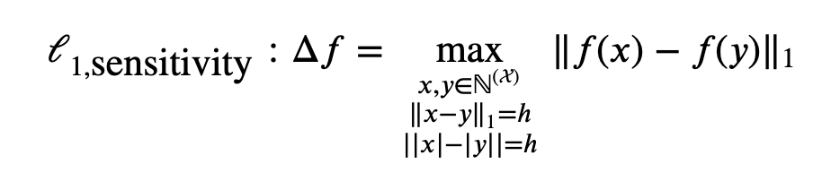
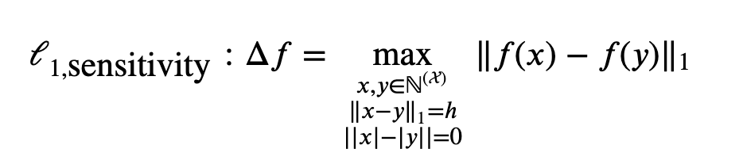
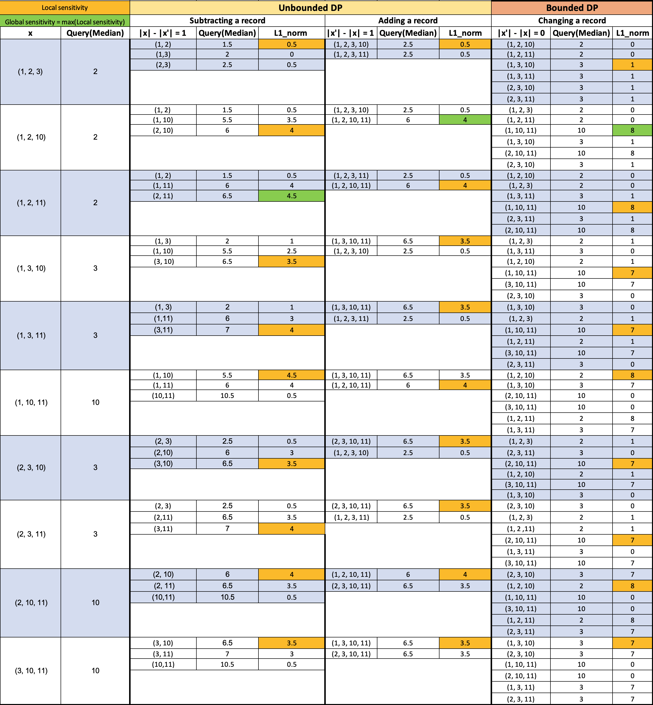
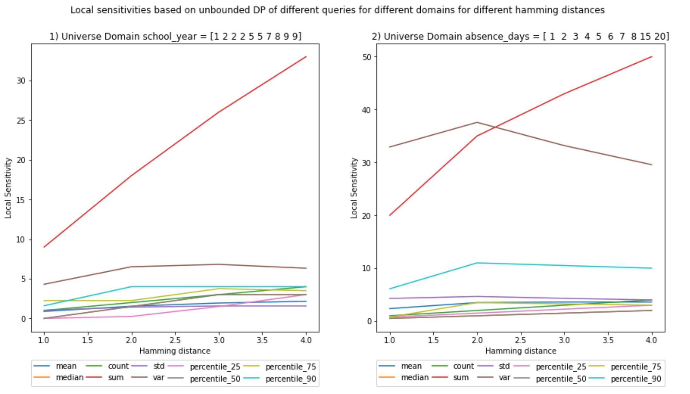

# Local Sensitivity From Scratch

## Goal

The goal of this notebook is to implement the calculation of local sensitivity from scratch. 
I benchmarked the results of these experiments against the results of the global sensitivity from my previous [blog post](https://github.com/gonzalo-munillag/Blog/blob/main/My_implementations/Global_sensitivity/Global_Sensitivity.ipynb). 

[Notebook](https://github.com/gonzalo-munillag/Blog/blob/main/My_implementations/Local_sensitivity/Local_Sensitivity.ipynb)

## Background

Local sensitivity differs from global sensitivity in that it considers only the dataset to be released and not all the possible release datasets. 
This means that one calculates the neighbors of the released dataset and not of all possible datasets. 
Furthermore, it is only within these neighbors and their corresponding release dataset where one finds the maximum norm. 
Global sensitivity is, therefore, an upper bound of local sensitivity. 

**Note: Unbounded sensitivity can be achieved in 2 ways, either by adding or subtracting records. In this notebook, I computed both at the same time and chose the one that yielded the highest sensitivity. However, I would say that in a real scenario, one could take either and calculate the sensitivity, as both equally protect the privacy of the individuals in the records. However, it is true that for the same privacy guarantees, one might use less noise than the other. This is an object for discussion.**

### Contributions of the notebook

1. I programmed two functions to calculate the local sensitivity of a dataset empirically.
2. I compared local and global sensitivity results.
3. I present a visualization of sensitivities for a median query, to show how to calculate sensitivities locally and how bounded and unbounded sensitivity differ visually

### Mean questions for clarification

- If local sensitivity would imply less noise due to its smaller value, then why do we not always use local sensitivity?  
If for each dataset you would calculate its particular local sensitivity, an adversary could also consider that when plotting noise distributions of the different possible dataset release combinations. These distributions would have a lower std (local sensitivity is lower than global sensitivity, so less noise), and thus, once the adversary gets a query DP result, it would be easier for him/her to discard possible release datasets (A visual representation of this process carried out by an attacker is in the [paper](https://git.gnunet.org/bibliography.git/plain/docs/Choosing-%CE%B5-2011Lee.pdf) I implemented 2 blog posts ago, depicted in Figs. 1 and 3). That is why some researchers invented smooth bounds for local sensitivities, but that is out of the scope of this blog post.

### Comments

This is a 3rd blog post of a series of posts revolving around [sensitivities](https://github.com/gonzalo-munillag/Blog/tree/main/My_implementations/Global_sensitivity) and [epsilon](https://github.com/gonzalo-munillag/Blog/tree/main/Extant_Papers_Implementations/A_method_to_choose_epsilon)
I invite you to have a look at them as well :)

**TIP**: The best way to understand this notebook better is to open my previous [blog post](https://github.com/gonzalo-munillag/Blog/blob/main/My_implementations/Global_sensitivity/Global_Sensitivity.ipynb) and go through the visualizations of scenario (a), and to cell 25 for unbounded and cell 33 for unbounded sensitivity in order to compare the raw data.

### Results

You can see the comparisons of the plots between local and global sensitivities. (Ignore the decimals on the x-axis, Hamming distances are integers)

For the visual representation, we have chosen:
- Universe of possible values: X = {1, 2, 3, 10, 11}
- Release dataset size (cardinality) = 3
- Hamming distance = 1
- x are all the possible value combinations from X
- x' are all the possible neighbors for each x
- Neighbor's cardinality difference is set to the Hamming distance of 1, | |x| - |x'| | = 1
- The L1 norm is calculated with the Query(Median) result of the possible release dataset (On the 2nd column) and with each of the Query(Median) results of each of the types of neighboring datasets.
- I select the first maximum for each group of L1 norms (The first cell in the column).

Notice that I calculated the local sensitivities on the horizontal axis; there is one per possible release dataset (first column). The global sensitivity is calculated in the vertical axis, selecting the maximum value out of all the L1 norms, i.e., selecting the maximum out of all local sensitivities.

The general form of L1 unbounded sensitivity:

General form of L1 bounded sensitivity:

**Here come the figures!**

**(Ignore the decimals on the x-axis, hamming distances are integers)**

#### UNBOUNDED - Local Sensitivity

It is interesting to see that the sensitivity for variance declines and at least for the sum the local sensitivity seems to be equal to the global sensitivity. 
The rest have lower values. This means that this particular dataset is the one with the maximum sensitivity for sum. 

##### Vs.

#### UNBOUNDED - Global Sensitivity

#### BOUNDED - Local Sensitivity

##### Vs.

#### BOUNDED - Global Sensitivity

At a first glance, the bounded local and global sensitivities seem equal, but if you pay close attention, for some queries they are not.
