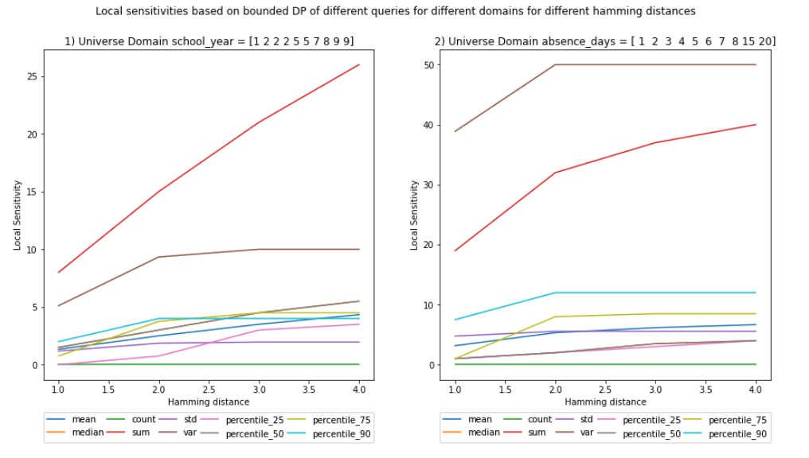

# Local Sensitivity From Scratch

## Goal

The goal of this notebook is to implement the calculation of local sensitvity form scratch. 
It is benchmarked against the results of the global sensitivity from my previos [blog post](https://github.com/gonzalo-munillag/Blog/blob/main/My_implementations/Global_sensitivity/Global_Sensitivity.ipynb). 

[Notebook](https://github.com/gonzalo-munillag/Blog/blob/main/My_implementations/Local_sensitivity/Local_Sensitivity.ipynb)

## Background

Local sensitivity differs from global sensitivity in that it considers only the dataset to be released, and not all the possible release datasets. 
This means that you only calculate the neighbors of the release dataset, and not of all possible datasets. 
And it is only within these neighbors and their corresponding release dataset that you find the maximum norm. 
Global sensitibvity is therefore an upper bound of local sensitivity. 

### Contributions of notebook

1. Two functions to calculate the local sensitivity of a dataset empirically.
2. Comparisons between local and global sensitivity results.

### Mean questions for clarification
- If local sensitivity would imply less noise due to its smaller value, then why do we not always use local sensitvity?  If for each dataset you would calculate its particular loca sensitvity, then adversary could also take that into consideration when plotting noise distributions of the different possible dataset release combinations. These distributions would have a lower std, and thus, once the adversary gets a query DP result, it would be easier for him/her to discard possible release datasets (A visual representation of this process carried out by an attacker is in the [paper](https://git.gnunet.org/bibliography.git/plain/docs/Choosing-%CE%B5-2011Lee.pdf) I implemented 2 blog posts ago, depicted in Figs. 1 and 3). That is why some researchers invented smooth bounds for local sensitivities, but that is something I will cover in future blog posts.

### Comments

This is a 3rd blog post of a series of posts revolving around [sensitivities](https://github.com/gonzalo-munillag/Blog/tree/main/My_implementations/Global_sensitivity) and [epsilon](https://github.com/gonzalo-munillag/Blog/tree/main/Extant_Papers_Implementations/A_method_to_choose_epsilon)
I invite you to have a look at them as well :)

**TIP**: The best way to understand this notebook better is to open my previous [blog post](https://github.com/gonzalo-munillag/Blog/blob/main/My_implementations/Global_sensitivity/Global_Sensitivity.ipynb) and go the visualizations of scenario (a), and to cell 25 for unbounded and cell 33 for unbounded sensitvity in order to compare the raw data.

### Results

You can see the comparisons of the plots between local and global sensitivities.

#### Local (i)

It is interesting to see that the sensitivity for variance declines and at least for the sum the local sensitivity seems to be equal to the global sensitivity. 
The rest have lower values. This means that this particular dataset is the one with the maximum sensitivity for sum. 

##### Vs.

#### Global (i)

#### Local (ii)

##### Vs.

#### global (ii)

